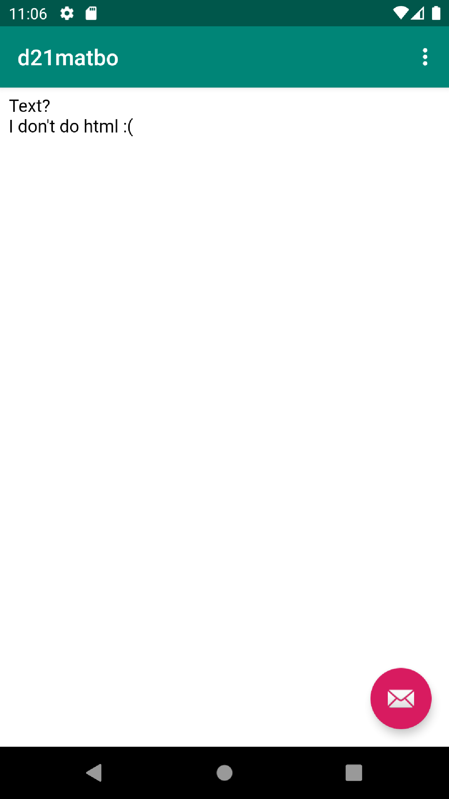
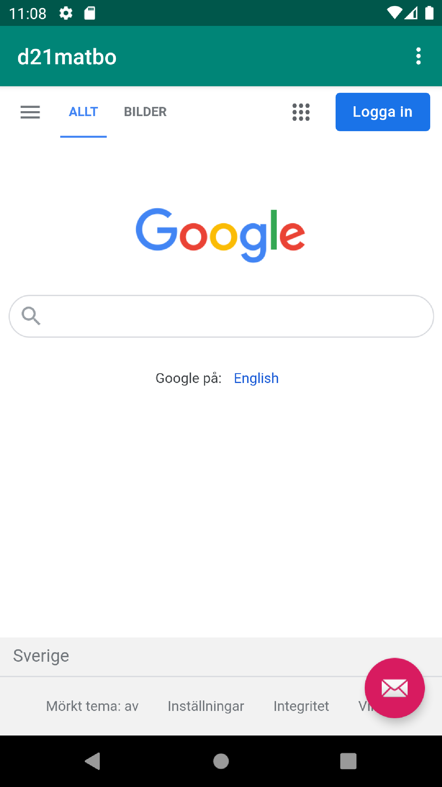

# Rapport

Bytte namn på applicationen och gav den tillgång till internet.
Skapade en webview komponent och gav den ett Id för att kunna skapa en referens till den i
programkod.
```
    private WebView myWebView;
```
Här skapas den privata variabeln myWebView av typen WebView, som ännu inte är instansierad
```
    myWebView = findViewById(R.id.my_webview);
```
Här instansieras variablen myWebView med den inbyggda funktionen "findViewById" + det Id denna
komponent tilldelades.

Skapade en assets folder som innehåller den interna html-filen och en extra mapp för utvecklings
möjligheter.

Gav programmet möjligheten att ladda in en URL, genom att använda den inbyggda funktionen
.loadURL("länkTillFil/Sida"), och kopplade detta till den givna menyfunktionen.



